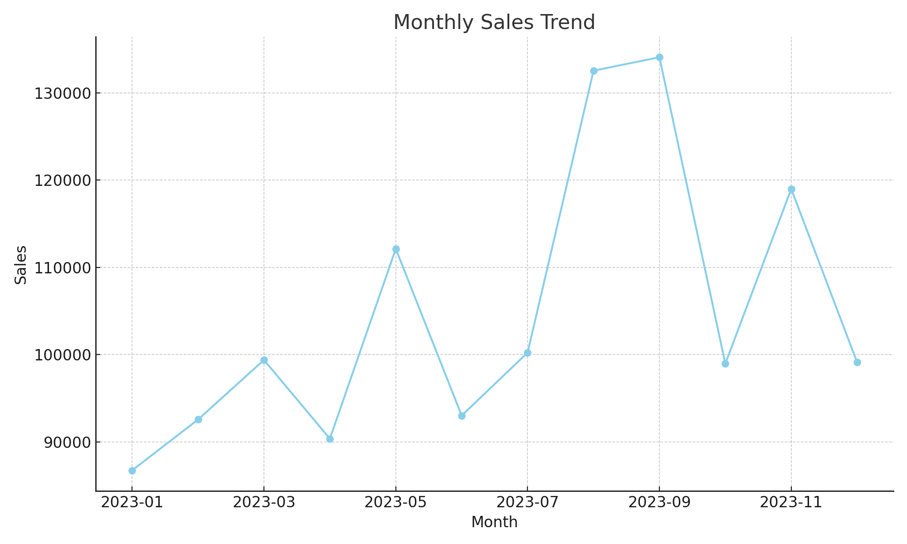

# 🛍️ Retail Sales Dashboard (Excel)

This project presents a retail sales dashboard built entirely in **Microsoft Excel**, aimed at showcasing key skills in data analysis, visualization, and dashboarding for business insights.

## 📊 Features
- Interactive KPIs: Total Sales, Profit, Orders, Units
- Visual Charts: Sales by Region, Category, Monthly Trend
- Pivot Tables & Slicers for detailed filtering
- Professional dashboard layout

## 📂 File Included
- `Retail_Sales_Dashboard_With_Pivot.xlsx`: Full interactive dashboard + pivot-ready data

## 🔍 Tools Used
- Excel (PivotTables, Charts, Slicers)
- Python (for data simulation and automation)

## 📸 Preview

## 📈 Key Insights
- Highest sales in **East Region**
- **Electronics** contributed the most to revenue
- Seasonal trend visible in Q4 sales growth

## 📚 Learnings
- Data cleansing, pivot modeling, KPI reporting
- Business storytelling through charts

## 💼 Ideal for
Fresher data analysts seeking to showcase Excel & analytical storytelling in their portfolios.
